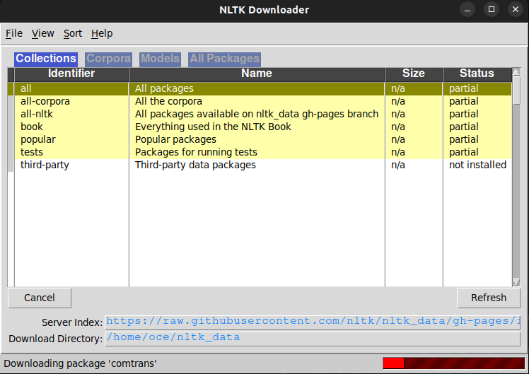

# AIstronoly
Make an AI to give your Astrology 
# How to demo

 ## Installation
 Sur le terminal, lancez : 
``` pip install nltk  ```
``` pip install tensorflow ```
 Sur un terminal python :

``` import nltk ```
``` nltk.download() ```
Vous devriez voir cette fenêtre apparaitre

Allez sur File > Download


 ## Lancement

### Sur Linux
#### Entrainement Automatique
``` python3 ./training.py ```

#### Entrainement Automatique
``` python3 ./chatbot.py ```

### Sur Windows
#### Entrainement Automatique
``` python .\training.py ```

#### Entrainement Automatique
``` python .\chatbot.py ```


